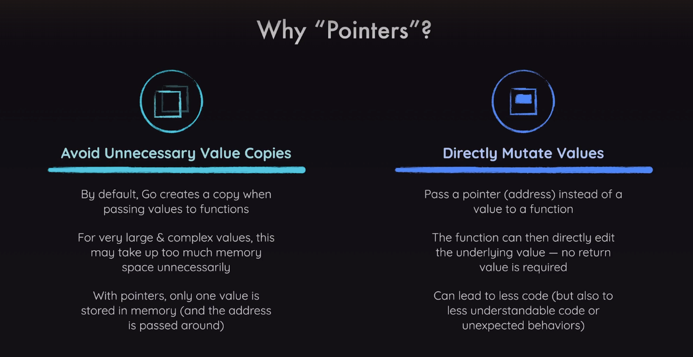
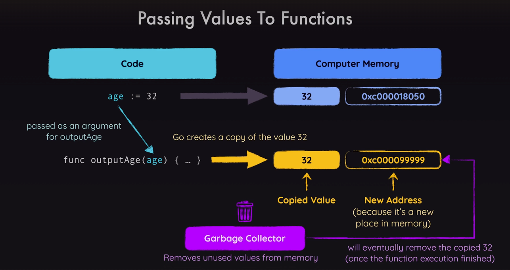
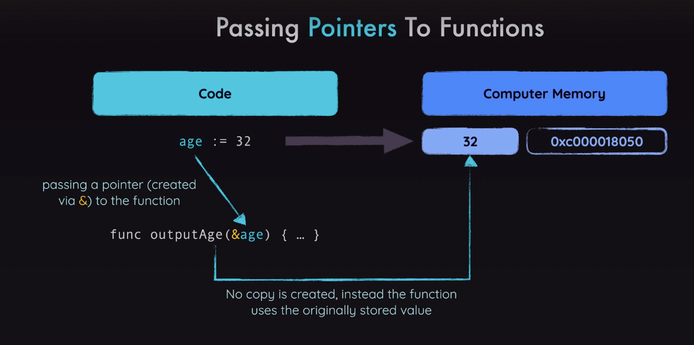

## Pointers

- Why to use pointers 
    - Avoid Unnecessary Value Copies
    - Directly Mutate Values



- To avoid this we use pointers



- Pointers example 
```go
// Pointer address example
age := 32
agePointer := &age 
// or 
// var agePointer *int
// agePointer = &age
fmt.Printf("The value is %d and it's address is %v, age value of pointer is %v\n", age, agePointer, *agePointer)
```

- Null Pointer example
```go
// null pointer
var nullPointer *int
fmt.Println(nullPointer)
```

- example code
```go
package main

import "fmt"

func main() {

	// Pointer address example
	age := 32
	agePointer := &age
	// or
	// var agePointer *int
	// agePointer = &age
	fmt.Printf("The value is %d and it's address is %v, age value of pointer is %v\n", age, agePointer, *agePointer)

	// null pointer
	var nullPointer *int
	fmt.Println(nullPointer)

	userAge := 32
	// function without pointers
	fmt.Println("Age: ", age)
	adultYears := getAdultYears(userAge)
	fmt.Println(adultYears)

	// using pointer and passing to function
	userAgePointer := &userAge
	adultYearsPointer := getAdultYearsUsingPointer(userAgePointer)
	fmt.Println(adultYearsPointer)

}

// no pointer function
func getAdultYears(age int) int {
	return age - 18
}

// pointer function
func getAdultYearsUsingPointer(age *int) int {
	return *age - 18
}
```
- output
```text
The value is 32 and it's address is 0x1400000e130, age value of pointer is 32
<nil>
Age:  32
14
14
```