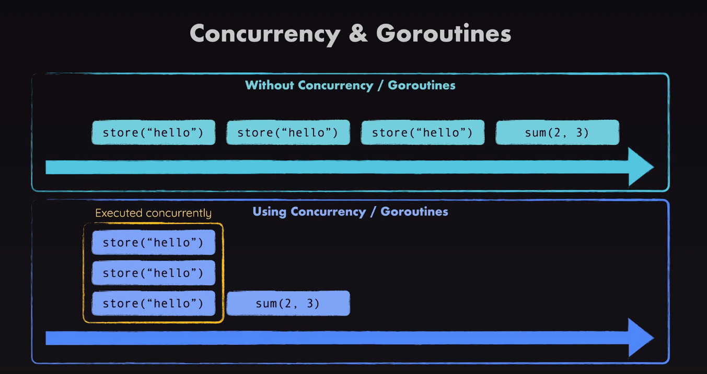

## Concurrency



- Understanding Go routing
```go
package main

import (
	"fmt"
	"time"
)

func main() {
	// add go to run in parallel
	go greed("World")
	go greed("Jack")
	go slowGreed("How are you")
	go greed("Is it ok")

}

func greed(phrase string) {
	fmt.Println("Hello ", phrase)
}

func slowGreed(phrase string) {
	time.Sleep(3 * time.Second) // simulate slow
	fmt.Println("Hello ", phrase)
}
```

- Sending Data with Channels
```go
// one channel
package main

import (
	"fmt"
	"time"
)

func main() {
	// add go to run in parallel
	// go greed("World")
	// go greed("Jack")

	// creating channels 
	done := make(chan bool)
	go slowGreed("How are you", done)
	// read from channel 
	// fmt.Println(<- done)
	<- done // go will continue after this line of code

	// go greed("Is it ok")

}

func greed(phrase string) {
	fmt.Println("Hello ", phrase)
}

func slowGreed(phrase string, doneChan chan bool) {
	time.Sleep(3 * time.Second) // simulate slow
	fmt.Println("Hello ", phrase)
	doneChan <- true
}
```

- sending data through multiple channels
```go
package main

import (
	"fmt"
	"time"
)

func main() {
	// add go to run in parallel
	// creating channels
	// dones := make([]chan bool, 4) // make channel list for 4 places
	done := make(chan bool)

	// dones[0] = make(chan bool)
	go greed("World", done)
	// dones[1] = make(chan bool)
	go greed("Jack", done)
	// dones[2] = make(chan bool)
	go slowGreed("How are you", done)
	// dones[3] = make(chan bool)
	go greed("Is it ok", done)

	for range done {
	}

	// for _, done := range dones {
	// 	<-done
	// }
	// read from channel
	// fmt.Println(<- done)
	// <-done // go will continue after this line of code
	// <-done
	// <-done
	// <-done
}

func greed(phrase string, doneChan chan bool) {
	fmt.Println("Hello ", phrase)
	doneChan <- true
}

func slowGreed(phrase string, doneChan chan bool) {
	time.Sleep(3 * time.Second) // simulate slow
	fmt.Println("Hello ", phrase)
	doneChan <- true
	close(doneChan)
}
```