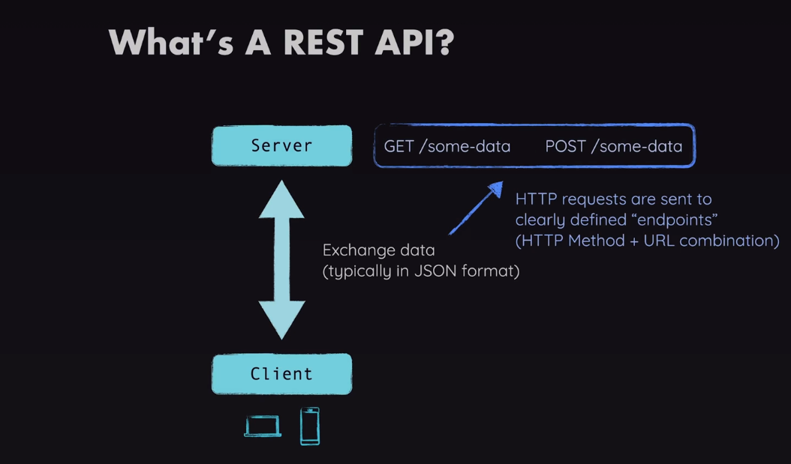
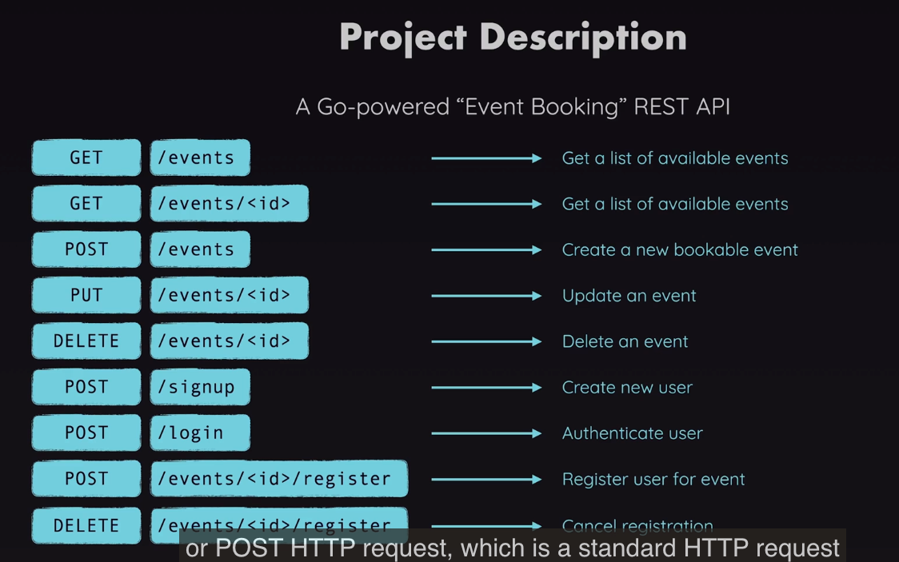

## REST API




- Installing Gin Framework
```sh
go get -u github.com/gin-gonic/gin
```

- Import gin
```go
import (
	"fmt"
	"github.com/gin-gonic/gin"
)
```

- GET request 
```go
package main

import (
	"fmt"

	"github.com/gin-gonic/gin"
)

func main() {
	server := gin.Default() // setup http server

	server.GET("/events", getEvents) // GET, POST, PUT, PATCH, DELETE // .GET("path", function())

	server.Run(":8080") // listen to localhost:8080
}

func getEvents(context *gin.Context) {
	fmt.Println("Server Started :)")
	// context.HTML()
	context.JSON(200, gin.H{
		"name":   "Joy",
		"age":    45,
		"salary": 500.5,
	})
}
```
